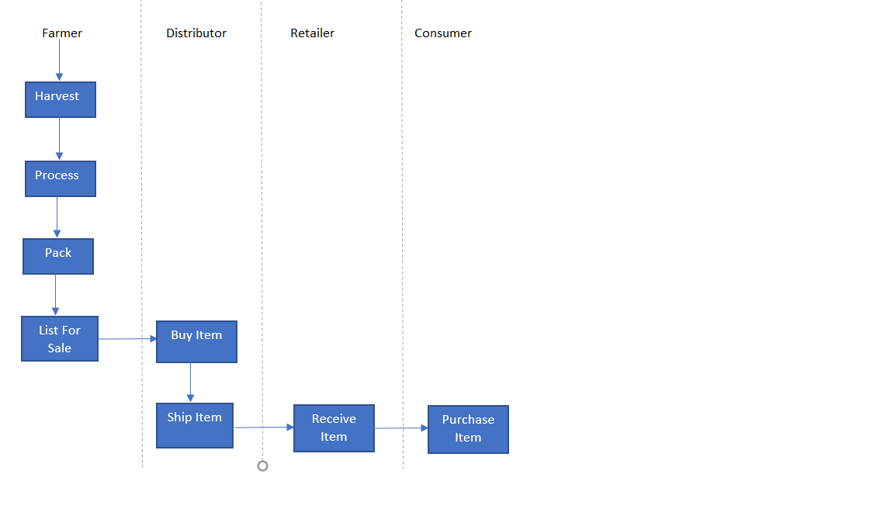
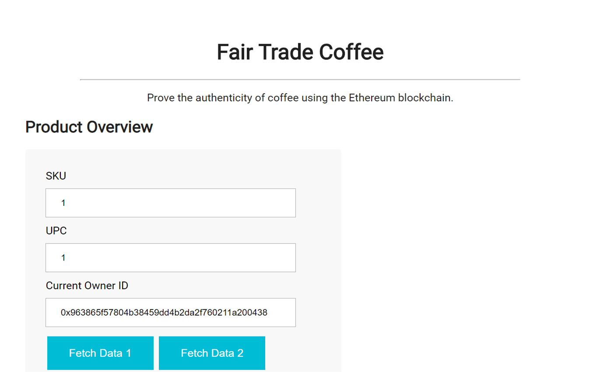
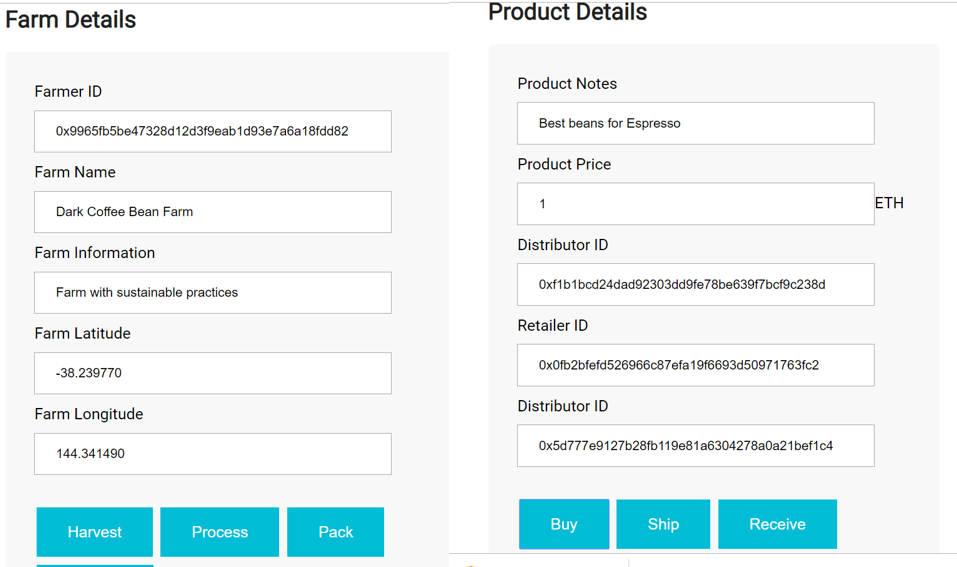
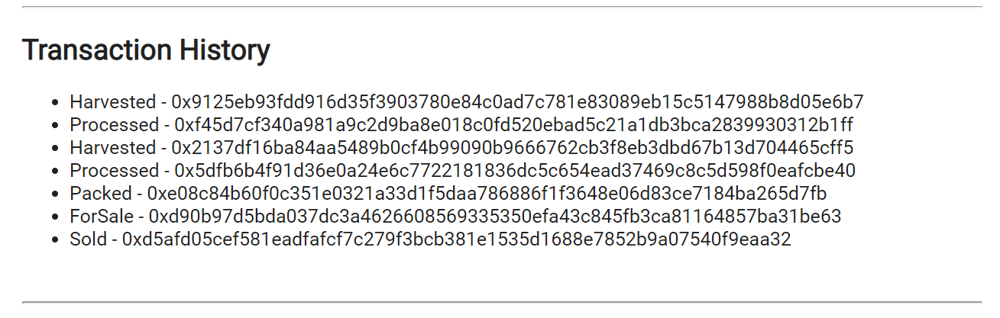

# Decentralized Supply Chain

## Concept:

One of the biggest challenges with supply chains is the lack of transparency in product tracking which leads to increased costs, counterfeit goods, and unnecessary waste. Decentralized implementation of supply chain helps in improving transparency in supply chain & traceability of the product w.r.t it's provenance. By effectively managing supply chain, companies are able to create more efficient solutions for customers.

This implementation considers the underlying asset to be Coffee Bean and demonstrates traceability & transparency as it moves through the supply chain.

At the core of these transactions is trust + automation  (of negotiations) this can be achieved by shared ledger which allows companies to collaborate & interact effectively

## Intended Benefits
Using block-chain shared ledger to collect data about the product at each stage can provide an auditable process to determine that product is safe & coming from reliable surces. This transaparency allows consumer to have more confidence in the legitimacy of the product. It will also benefit a lot in tracing origin of product is valuable when product recall is needed

## Architecture:

BlockChain Solution Layers:

**Smart Contracts** that help track product origination and verify product authenticity

-  Asset: any physical or digital entity that requires tracking in this case Coffe Bean
	Asset Attributes:
		a. UPC (Unique Product Code)
		b. Owner Address
		c. Farmer Address
		d. Farm Name
		e. Farm Latitude
		f. Farm Longitude
		g. Product Notes
		h. Product Price
		i. Distributor Address
		j. Retailer Address
		k. Consumer Address
	
- Actors: who interact with this asset and trandform it from one state to another
	a. Farmer
	b. Distributor
	c. Retailer
	d. Consumer

- Role Permissions: for each actor

- Business Process:
progression of assets through various steps of business process which is recorded on chain for lookback and evidence of trail

**DAPP Client** The front-end of the application runs on the client's machine, powered by a lite-server. Using web3/metamask (using infura's endpoints), it communicates with the deployed smart contract from Ethereum Rinkeby Test Network. 
It allows users to manage the product life-cycle as the product moves through the supply chain

## Supply Chain Modelling for Coffee Bean : 

The underlying assset i.e. coffee bean in this supply chain moves through below states via interaction with actors (Farmer, Distributor, Retailer, Consumer)

1. Harvested
2. Processed
3. Packed
4. Lised for Sale
5. Buy
6. Ship
7. Receive
8. Purchase

## Implementation Walkthrough ##

**Product Overview**
- SKU Is generated automatically by the system. Starts with 0 and increments as more items are added
- UPC is the unique id of the asset using which the  actors can track . Fetch Data 1 and Fetch Data 2 will return the state of the asset from blockchain

**State Changes of Asset through DAPP**

- Harvest [From Farmer] initiates transaction to Harvest a new asset identified by the inserted upc. It will not be a permitted  if the current account is NOT a FarmerRole.

- Process [From Farmer] initiates transaction to Process the Harvested Asset. It will not be a permitted  if the current account is NOT a FarmerRole. And the current state of the Asset is not Harvested

- Pack [From Farmer] initiates transaction to Pack the Processed Asset. It will not be a permitted  if the current account is NOT a FarmerRole. And the current state of the Asset is not Processed

- List for Sale [From Farmer] initiates transaction to List for Sale the Processed Asset. It will not be a permitted  if the current account is NOT a FarmerRole. And the current state of the Asset is not Packed

- Buy [From Distributor] initiates transaction to Buy the asset Listed for Sale. It will not be a permitted  if the current account is NOT a Distributor Role. And the current state of the Asset is not Listed for Sale.
  This transaction is payable as the distributor has to provide minimum ether to paid to farmer as per the price of the product. Excess ether is transferred back to the distributor.
  
- Shipped [From Distributor] initiates transaction to Ship the asset Listed to Retailer It will not be a permitted  if the current account is NOT a Distributor Role. And the current state of the Asset is not Sold.

- Received [From Retailer] initiates transaction to mark an item as 'Received'. It will not be a permitted  if the current account is NOT a Retailer Role. And the current state of the Asset is not Shipped.

- PurchaseItem [From Consumer] initiates transaction to mark an item as 'Purchased'. It will not be a permitted  if the current account is NOT a Consumer Role. And the current state of the Asset is not Received.

**Transaction History**
The app listent to all events and displays them

## Installation
Truffle Verson
Truffle v4.1.15 (core: 4.1.15)

Node Version v10.15.3

Solidity Version: Solidity v0.4.25 (solc-js)

Launch Ganache: ganache-cli -l 10000000

Compilation: truffle compile

Migrate :  smart contracts to the locally running blockchain, ganache-cli:truffle migrate

In a separate terminal window, launch the DApp:
npm run dev

	

